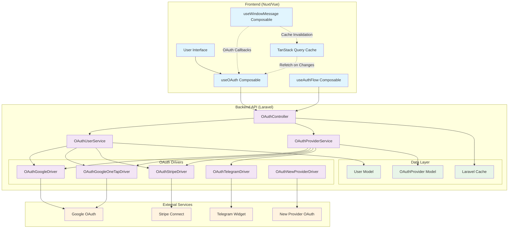
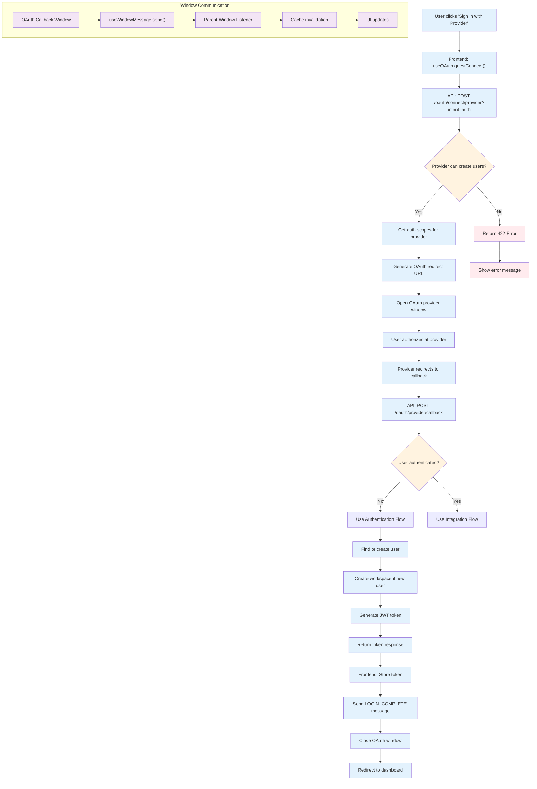
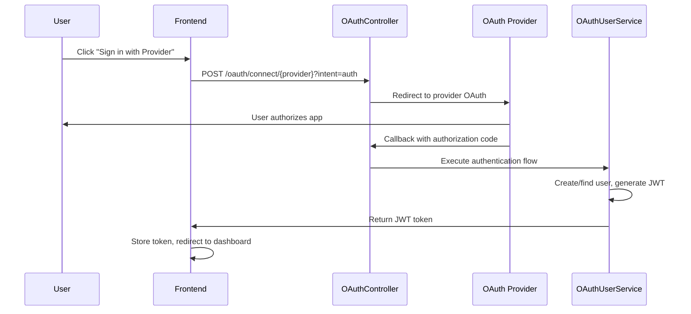
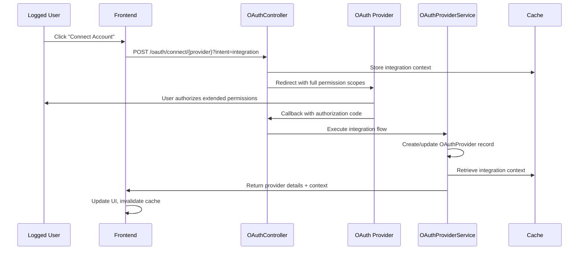
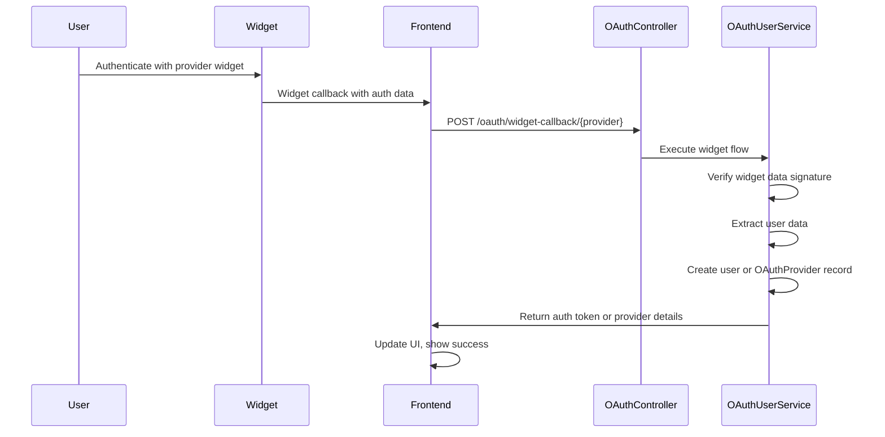

This guide covers how to add new OAuth integrations to OpnForm. The system uses a modern, service-oriented architecture with intent-based OAuth flows to handle different authentication scenarios including user authentication, account integrations, and widget-based providers.

<Card title="Configuration Guide" icon="gear" href="/configuration/oauth-setup">
    Before implementing a new integration, you may want to review the OAuth
    configuration guide to understand how to set up the existing Google, Stripe,
    and Telegram integrations.
</Card>

## System Architecture Overview

OpnForm's OAuth system is built around several key architectural patterns:

-   **Intent-based Flows**: Different OAuth scopes and handling based on auth vs integration intents
-   **Driver Pattern**: Abstracted OAuth provider implementations with support for redirect and widget flows
-   **Service Layer**: Centralized user and provider management through dedicated services
-   **Message-based Communication**: Cross-window communication for OAuth callbacks



## Core Components

### 1. OAuthController (`api/app/Http/Controllers/Auth/OAuthController.php`)

The main controller that orchestrates OAuth flows:

```php
class OAuthController extends Controller
{
    public function __construct(
        private OAuthUserService $oauthUserService,
        private OAuthProviderService $oauthProviderService
    ) {}

    // Initiates OAuth flow with intent-based scoping
    public function redirect(Request $request, string $provider)

    // Handles standard OAuth callbacks
    public function callback(string $provider)

    // Handles widget-based OAuth (e.g., Telegram, Google One Tap)
    public function handleWidgetCallback(string $service, Request $request)
}
```

**Key Features:**

-   **Intent-based scoping**: Different OAuth scopes for `auth` vs `integration` flows
-   **Context caching**: Stores integration context for callback handling
-   **Flow determination**: Automatically chooses authentication vs integration flow based on user state

### 2. OAuthUserService (`api/app/Service/OAuth/OAuthUserService.php`)

Service that handles user-related OAuth operations:

```php
class OAuthUserService
{
    // Handles user authentication and registration flow
    public function handleAuthenticationFlow(OAuthProviderService $provider, SocialiteUser $socialiteUser): JsonResponse

    // Finds or creates user from OAuth provider data
    public function findOrCreateUser(OAuthProviderService $provider, SocialiteUser $socialiteUser): User
}
```

### 3. OAuthProviderService (`api/app/Service/OAuth/OAuthProviderService.php`)

Service that handles provider-related OAuth operations:

```php
class OAuthProviderService
{
    // Handles provider connection and integration flow
    public function handleIntegrationFlow(OAuthProviderService $provider, SocialiteUser $socialiteUser): JsonResponse

    // Creates or updates OAuth provider records
    public function createOrUpdateProvider(OAuthProviderService $provider, SocialiteUser $socialiteUser): OAuthProvider
}
```

### 4. Intent-based Flow Handling

The system uses intent-based flow handling instead of strategies:

#### Authentication Flow

For user login/registration when user is not authenticated:

```php
// In OAuthController::callback()
if (!Auth::check()) {
    // User not authenticated - handle auth flow
    return $this->oauthUserService->handleAuthenticationFlow($providerService, $socialiteUser);
}
```

#### Integration Flow

For connecting OAuth accounts when user is already logged in:

```php
// In OAuthController::callback()
if (Auth::check()) {
    // User authenticated - handle integration flow
    return $this->oauthProviderService->handleIntegrationFlow($providerService, $socialiteUser);
}
```

#### Widget Flow

For widget-based authentication (like Telegram Login Widget, Google One Tap):

```php
// In OAuthController::handleWidgetCallback()
if ($request->input('intent') === 'auth') {
    return $this->oauthUserService->handleWidgetAuthFlow($providerService, $request);
} else {
    return $this->oauthProviderService->handleWidgetIntegrationFlow($providerService, $request);
}
```

### 5. OAuth Drivers

Each provider implements the `OAuthDriver` interface:

```php
interface OAuthDriver
{
    public function getRedirectUrl(): string;
    public function getUser(): User;
    public function canCreateUser(): bool;
    public function getScopesForIntent(string $intent): array;
}
```

For widget-based providers, implement `WidgetOAuthDriver`:

```php
interface WidgetOAuthDriver extends OAuthDriver
{
    public function verifyWidgetData(array $data): bool;
    public function getUserFromWidgetData(array $data): array;
    public function isWidgetBased(): bool;
}
```

## OAuth Flow Types

### Authentication Flow (User Login/Registration)





**Key Steps:**

1. Frontend calls `/oauth/connect/{provider}` with `intent=auth`
2. Controller validates provider can create users
3. User redirected to OAuth provider with basic scopes
4. Provider callbacks to `/oauth/{provider}/callback`
5. `AuthenticationStrategy` handles user creation/login
6. JWT token returned for client-side authentication

### Integration Flow (Connect Account)



**Key Features:**

-   **Enhanced scopes**: Requests full permissions needed for integrations
-   **Context preservation**: Stores `intention` and `autoClose` settings in cache
-   **Provider management**: Creates/updates `OAuthProvider` records

### Widget Flow (e.g., Telegram)



**Widget Authentication Features:**

-   **No redirect flow**: Authentication happens in-place via widget
-   **Data verification**: Cryptographic verification of widget data
-   **Direct provider creation**: Immediately creates provider records

## Frontend Integration

### Window Message Communication

The frontend uses `useWindowMessage` composable for cross-window communication:

```javascript
// WindowMessageTypes for consistent messaging
export const WindowMessageTypes = {
    LOGIN_COMPLETE: "login-complete",
    AFTER_LOGIN: "after-login",
    OAUTH_PROVIDER_CONNECTED: "oauth-provider-connected",
};

// Usage in OAuth callback
const { send } = useWindowMessage(WindowMessageTypes.LOGIN_COMPLETE);
send(window.opener, {
    eventType: WindowMessageTypes.LOGIN_COMPLETE,
    useMessageChannel: false,
    waitForAcknowledgment: false,
});
```

### OAuth Composable (`useOAuth`)

Centralized OAuth operations with TanStack Query integration:

```javascript
const { connect, connectMutation, services } = useOAuth();

// Connect to OAuth provider
await connect("google", false, true, true); // service, redirect, newtab, autoClose

// Service definitions with auth types
const services = [
    {
        name: "google",
        title: "Google",
        auth_type: "redirect", // Standard OAuth redirect flow
    },
    {
        name: "telegram",
        title: "Telegram",
        auth_type: "widget", // Widget-based authentication
        widget_file: "TelegramWidget",
    },
];
```

### Cache Management

The system automatically invalidates TanStack Query cache when OAuth connections change:

```javascript
// Listen for OAuth provider connections
windowMessage.listen(
    (_event) => {
        invalidateProviders(); // Refresh OAuth providers list
    },
    {
        useMessageChannel: false,
        acknowledge: false,
    }
);
```

## Adding a New Integration

Follow these steps to add a new OAuth provider to OpnForm:

<Steps>
<Step title="Create OAuth Driver">
Implement the OAuth driver class:

```php
// api/app/Integrations/OAuth/Drivers/OAuthNewProviderDriver.php
<?php

namespace App\Integrations\OAuth\Drivers;

use App\Http\Controllers\Auth\OAuthController;
use App\Integrations\OAuth\Drivers\Contracts\OAuthDriver;
use Laravel\Socialite\Contracts\User;
use Laravel\Socialite\Facades\Socialite;

class OAuthNewProviderDriver implements OAuthDriver
{
    private ?string $redirectUrl = null;
    private ?array $scopes = [];
    protected $provider;

    public function __construct()
    {
        $this->provider = Socialite::driver('newprovider');
    }

    public function getRedirectUrl(): string
    {
        return $this->provider
            ->scopes($this->scopes ?? [])
            ->stateless()
            ->redirectUrl($this->redirectUrl ?? config('services.newprovider.redirect'))
            ->redirect()
            ->getTargetUrl();
    }

    public function getUser(): User
    {
        return $this->provider
            ->stateless()
            ->redirectUrl($this->redirectUrl ?? config('services.newprovider.redirect'))
            ->user();
    }

    public function canCreateUser(): bool
    {
        return true; // Set false if provider can't be used for user registration
    }

    public function setRedirectUrl(string $url): OAuthDriver
    {
        $this->redirectUrl = $url;
        return $this;
    }

    public function setScopes(array $scopes): OAuthDriver
    {
        $this->scopes = $scopes;
        return $this;
    }

    public function getScopesForIntent(string $intent): array
    {
        return match ($intent) {
            OAuthFlowOrchestrator::INTENT_AUTH => ['user:email', 'read:user'],
            OAuthFlowOrchestrator::INTENT_INTEGRATION => ['user:email', 'read:user', 'write:data'],
            default => ['user:email', 'read:user'],
        };
    }
}
```

<Tip>
Configure different scopes for `auth` vs `integration` intents using the `OAuthFlowOrchestrator::INTENT_AUTH` and `OAuthFlowOrchestrator::INTENT_INTEGRATION` constants. Auth scopes should be minimal (just enough for user identification), while integration scopes should include all permissions needed for the provider's functionality.
</Tip>
</Step>

<Step title="Register in Provider Service">
Add your new provider to the enum:

```php
// api/app/Integrations/OAuth/OAuthProviderService.php
enum OAuthProviderService: string
{
    case Google = 'google';
    case GoogleOneTap = 'google_one_tap';
    case Stripe = 'stripe';
    case Telegram = 'telegram';
    case NewProvider = 'newprovider'; // Add your provider

    public function getDriver(): OAuthDriver
    {
        return match ($this) {
            self::Google => new OAuthGoogleDriver(),
            self::GoogleOneTap => new OAuthGoogleOneTapDriver(),
            self::Stripe => new OAuthStripeDriver(),
            self::Telegram => new OAuthTelegramDriver(),
            self::NewProvider => new OAuthNewProviderDriver(), // Add mapping
        };
    }

    public function getDatabaseProvider(): string
    {
        return match ($this) {
            self::Google => 'google',
            self::GoogleOneTap => 'google', // Normalize to 'google'
            self::Stripe => 'stripe',
            self::Telegram => 'telegram',
            self::NewProvider => 'newprovider',
        };
    }
}
```

</Step>

<Step title="Configure Services">
Add configuration to `api/config/services.php`:

```php
// api/config/services.php
'newprovider' => [
    'client_id' => env('NEWPROVIDER_CLIENT_ID'),
    'client_secret' => env('NEWPROVIDER_CLIENT_SECRET'),
    'redirect' => env('APP_URL') . '/oauth/newprovider/callback',
],
```

Add environment variables to `.env.example`:

```bash
# New Provider OAuth
NEWPROVIDER_CLIENT_ID=
NEWPROVIDER_CLIENT_SECRET=
```

</Step>

<Step title="Install Socialite Provider">
If using a community Socialite provider, add it to `composer.json`:

```bash
cd api && composer require socialiteproviders/newprovider
```

Register in `api/app/Providers/EventServiceProvider.php`:

```php
protected $listen = [
    \SocialiteProviders\Manager\SocialiteWasCalled::class => [
        'SocialiteProviders\\NewProvider\\NewProviderExtendSocialite@handle',
    ],
];
```

</Step>

<Step title="Add Frontend Service Definition">
Update the frontend service configuration:

```javascript
// client/composables/query/useOAuth.js
const services = computed(() => {
    return [
        // ... existing services
        {
            name: "newprovider",
            title: "New Provider",
            icon: "mdi:newprovider", // Use appropriate icon
            enabled: useFeatureFlag("services.newprovider.client_id", false),
            auth_type: "redirect",
        },
    ];
});
```

</Step>

<Step title="Add Feature Flag">
Update feature flags controller to expose the provider:

```php
// api/app/Http/Controllers/Content/FeatureFlagsController.php
public function index(): JsonResponse
{
    return response()->json([
        // ... existing flags
        'services' => [
            // ... existing services
            'newprovider' => [
                'client_id' => !!config('services.newprovider.client_id'),
            ],
        ],
    ]);
}
```

</Step>

<Step title="Test the Integration">
Test both authentication and integration flows:

**Authentication Test:**

1. Start fresh (logged out)
2. Click "Sign in with New Provider"
3. Complete OAuth flow
4. Verify user creation and login

**Integration Test:**

1. Log in with existing account
2. Go to Settings → Connections
3. Click "Connect New Provider"
4. Complete OAuth flow
5. Verify provider appears in connected accounts

<Check>
Verify both flows work correctly and check that appropriate scopes are requested for each intent.
</Check>
</Step>

<Step title="Add Integration Handler (Optional)">
If your provider will be used for form integrations, create an integration handler:

```php
// api/app/Integrations/Handlers/NewProviderIntegration.php
<?php

namespace App\Integrations\Handlers;

use App\Integrations\Handlers\AbstractIntegrationHandler;

class NewProviderIntegration extends AbstractIntegrationHandler
{
    public static function getValidationRules(): array
    {
        return [
            'oauth_id' => 'required|exists:oauth_providers,id',
            'settings' => 'required|array'
        ];
    }

    public function handle(array $data): bool
    {
        // Implement integration logic here
        // e.g., send data to external API, create records, etc.

        return true;
    }
}
```

Register the handler and add frontend integration components as needed.

</Step>
</Steps>

## Provider Normalization

<Info>
    **Important**: When creating providers that represent the same OAuth service
    but with different authentication methods (like Google OAuth vs Google One
    Tap), they should be normalized to the same provider name in the database.
</Info>

OpnForm handles provider normalization through the `getDatabaseProvider()` method in the enum:

```php
public function getDatabaseProvider(): string
{
    return match ($this) {
        self::Google => 'google',
        self::GoogleOneTap => 'google', // Both normalize to 'google'
        self::Stripe => 'stripe',
        self::Telegram => 'telegram',
    };
}
```

This ensures that:

-   Users can't connect multiple "Google" accounts (regular OAuth + One Tap)
-   Provider scopes and permissions are properly merged
-   The same OAuth provider record is updated regardless of authentication method
-   Integration handlers work consistently with the normalized provider name

When adding new providers, consider if they should be normalized:

-   **Same OAuth service, different auth methods**: Normalize (like Google/GoogleOneTap)
-   **Different OAuth services**: Don't normalize (like Google/GitHub)

## Widget-Based Providers

For providers that use widget authentication (like Telegram), implement `WidgetOAuthDriver`:

<Tabs>
<Tab title="Driver Implementation">
```php
<?php

namespace App\Integrations\OAuth\Drivers;

use App\Integrations\OAuth\Drivers\Contracts\WidgetOAuthDriver;

class OAuthWidgetProviderDriver implements WidgetOAuthDriver
{
public function verifyWidgetData(array $data): bool
{
// Implement cryptographic verification of widget data
// e.g., HMAC signature verification

        $expectedHash = hash_hmac('sha256', $dataString, $secretKey);
        return hash_equals($expectedHash, $data['hash']);
    }

    public function getUserFromWidgetData(array $data): array
    {
        return [
            'id' => $data['user_id'],
            'name' => $data['name'],
            'email' => $data['email'] ?? null,
            'provider_user_id' => $data['user_id'],
            'access_token' => $data['auth_token'],
            'scopes' => []
        ];
    }

    public function isWidgetBased(): bool
    {
        return true;
    }

    // Standard OAuthDriver methods...
    public function getRedirectUrl(): string
    {
        return ''; // Not used for widget auth
    }

}

````
</Tab>

<Tab title="Frontend Widget Component">
```vue
<!-- client/components/settings/widgets/WidgetProviderWidget.vue -->
<template>
  <div class="widget-provider-container">
    <div
      id="widget-provider-login"
      @click="initializeWidget"
    >
      Connect Widget Provider
    </div>
  </div>
</template>

<script setup>
const emit = defineEmits(['auth-data'])

const initializeWidget = () => {
  // Initialize provider widget
  // Handle widget callback and emit auth data

  window.WidgetProvider.init({
    onAuth: (authData) => {
      emit('auth-data', authData)
    }
  })
}
</script>
````

</Tab>

<Tab title="Frontend Service Config">
```javascript
// Update service definition for widget providers
{
  name: 'widgetprovider',
  title: 'Widget Provider',
  icon: 'mdi:widget',
  enabled: useFeatureFlag('services.widgetprovider.enabled', false),
  auth_type: 'widget',
  widget_file: 'WidgetProviderWidget'
}
```
</Tab>
</Tabs>

## Advanced Configuration

### Custom Scopes and Parameters

OAuth drivers can customize the authorization request:

```php
public function getRedirectUrl(): string
{
    return $this->provider
        ->scopes($this->scopes)
        ->stateless()
        ->redirectUrl($this->redirectUrl)
        ->with([
            'access_type' => 'offline',
            'prompt' => 'consent',
            'custom_param' => 'value'
        ])
        ->redirect()
        ->getTargetUrl();
}
```

### Error Handling

The system includes comprehensive error handling:

```php
// In OAuthConnectionService
public function handleCallback(OAuthProviderService $provider, OAuthCompletionStrategy $strategy): JsonResponse
{
    try {
        $driverUser = $provider->getDriver()->getUser();
        return $strategy->execute($provider, $driverUser);
    } catch (\Exception $e) {
        report($e);
        return response()->json(['message' => 'Failed to authenticate with the provider. Please try again.'], 400);
    }
}
```

### Intent-Based Flow Control

The controller automatically selects the appropriate flow based on user authentication state:

```php
public function callback(string $provider)
{
    $providerService = OAuthProviderService::from($provider);
    $socialiteUser = $providerService->getDriver()->getUser();

    // Flow is determined by the user's authentication state
    if (Auth::check()) {
        // User logged in = integration flow
        return $this->oauthProviderService->handleIntegrationFlow($providerService, $socialiteUser);
    } else {
        // User not logged in = authentication flow
        return $this->oauthUserService->handleAuthenticationFlow($providerService, $socialiteUser);
    }
}
```

## Troubleshooting

<AccordionGroup>
<Accordion title="Provider not appearing in frontend">
- Check feature flag configuration in `FeatureFlagsController`
- Verify environment variables are set
- Ensure service is added to `useOAuth` services list
- Check browser console for JavaScript errors
</Accordion>

<Accordion title="OAuth redirect URL mismatch">
    - Verify `redirect` URL in `config/services.php` matches provider
    configuration - Check that `APP_URL` environment variable is correct -
    Ensure provider OAuth app is configured with correct callback URL
</Accordion>

<Accordion title="Scopes not working correctly">
    - Check `getScopesForIntent()` method returns correct scopes - Verify
    provider OAuth app has necessary permissions enabled - Test with minimal
    scopes first, then add additional ones
</Accordion>

<Accordion title="Widget authentication failing">
- Verify widget data signature verification logic
- Check that widget script is loaded correctly
- Ensure widget callback URL is accessible and correct
- Test widget data extraction and user creation flow
</Accordion>
</AccordionGroup>

## Best Practices

<Card title="Security" icon="shield-check">
    - Always verify widget data signatures cryptographically - Use minimal
    scopes for authentication flows - Validate all OAuth provider responses -
    Implement proper error handling and logging
</Card>

<Card title="User Experience" icon="heart">
    - Provide clear loading states during OAuth flows - Handle popup blockers
    gracefully - Show appropriate error messages for OAuth failures - Auto-close
    OAuth windows when appropriate
</Card>

<Card title="Performance" icon="bolt">
    - Cache OAuth provider configurations - Use TanStack Query for efficient
    data fetching - Implement proper cleanup for event listeners - Minimize API
    calls during OAuth flows
</Card>

This comprehensive architecture allows OpnForm to support any OAuth provider with a consistent, maintainable codebase that handles all the complexities of modern OAuth flows.
