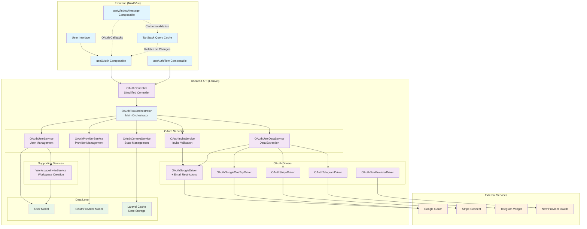
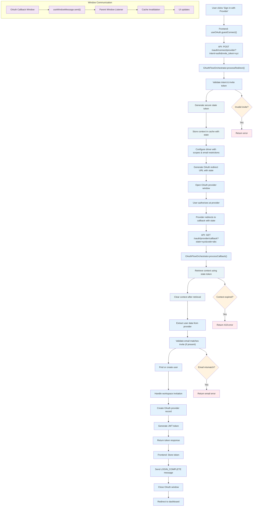
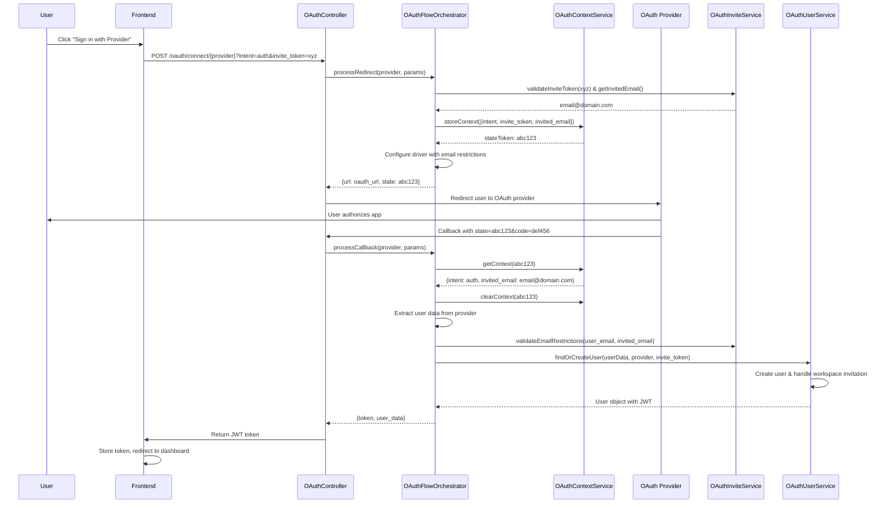
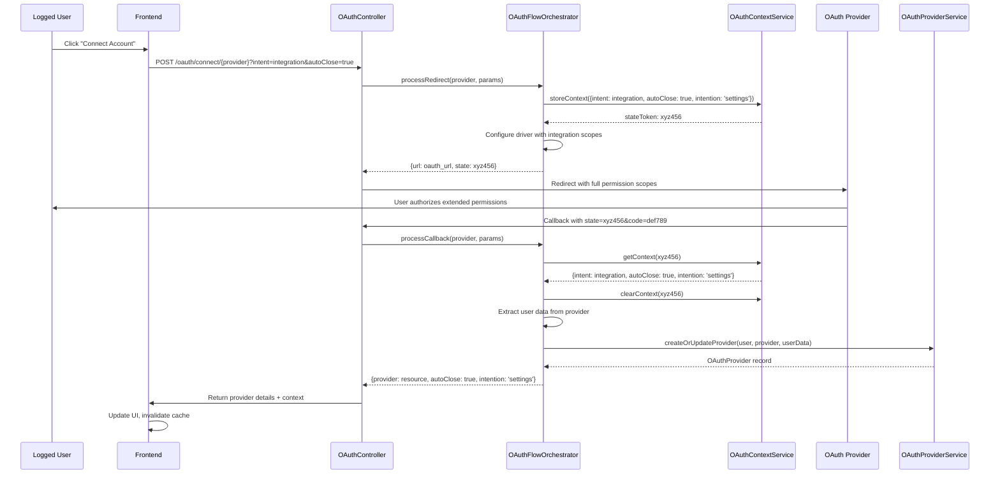
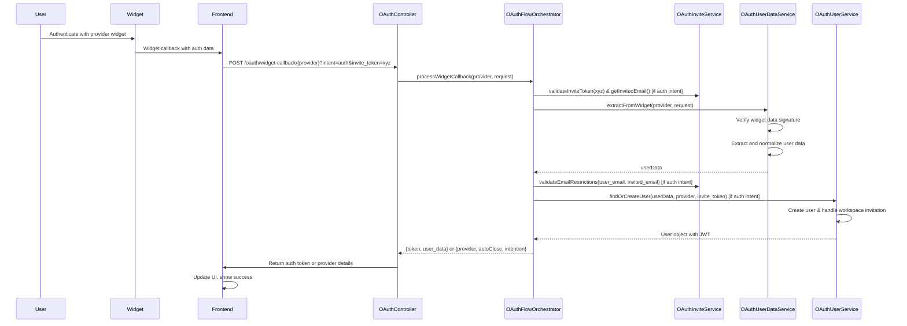

This guide covers how to add new OAuth integrations to OpnForm. The system uses a modern, service-oriented architecture with intent-based OAuth flows to handle different authentication scenarios including user authentication, account integrations, and widget-based providers.

<Card title="Configuration Guide" icon="gear" href="/configuration/oauth-setup">
    Before implementing a new integration, you may want to review the OAuth
    configuration guide to understand how to set up the existing Google, Stripe,
    and Telegram integrations.
</Card>

## System Architecture Overview

OpnForm's OAuth system is built around several key architectural patterns:

-   **Intent-based Flows**: Different OAuth scopes and handling based on auth vs integration intents
-   **Orchestrator Pattern**: Central `OAuthFlowOrchestrator` coordinates all OAuth flows
-   **Service-Oriented Architecture**: Specialized services handle context, user data, invites, and provider management
-   **State-based Context Management**: Secure state tokens replace session-based context storage
-   **Driver Pattern**: Abstracted OAuth provider implementations with support for redirect and widget flows
-   **Email Restrictions**: Capability-based email restrictions for workspace invitations
-   **Message-based Communication**: Cross-window communication for OAuth callbacks



## Core Components

### 1. OAuthController (`api/app/Http/Controllers/Auth/OAuthController.php`)

The simplified controller that delegates all OAuth logic to the orchestrator:

```php
class OAuthController extends Controller
{
    public function __construct(
        private OAuthFlowOrchestrator $flowOrchestrator
    ) {}

    // Initiates OAuth flow using validated request
    public function redirect(OAuthRedirectRequest $request, string $provider)
    {
        return response()->json(
            $this->flowOrchestrator->processRedirect(
                $provider,
                $request->validated()
            )
        );
    }

    // Handles standard OAuth callbacks
    public function callback(Request $request, string $provider)
    {
        $params = $request->all();
        $result = $this->flowOrchestrator->processCallback($provider, $params);
        return response()->json($result);
    }

    // Handles widget-based OAuth
    public function handleWidgetCallback(Request $request, string $service)
    {
        $result = $this->flowOrchestrator->processWidgetCallback($service, $request);
        return response()->json($result);
    }
}
```

**Key Features:**

-   **Simplified Architecture**: All logic delegated to `OAuthFlowOrchestrator`
-   **Request Validation**: Uses `OAuthRedirectRequest` for structured validation
-   **Consistent Responses**: Standardized JSON response format

### 2. OAuthFlowOrchestrator (`api/app/Service/OAuth/OAuthFlowOrchestrator.php`)

The main orchestrator service that coordinates all OAuth flows:

```php
class OAuthFlowOrchestrator
{
    public const INTENT_AUTH = 'auth';
    public const INTENT_INTEGRATION = 'integration';

    public function __construct(
        private OAuthContextService $contextService,
        private OAuthInviteService $inviteService,
        private OAuthUserDataService $userDataService,
        private OAuthUserService $oauthUserService,
        private OAuthProviderService $oauthProviderService
    ) {}

    // Process OAuth redirect with state management
    public function processRedirect(string $provider, array $params): array

    // Process OAuth callback with context restoration
    public function processCallback(string $provider, array $params): array

    // Process widget-based OAuth
    public function processWidgetCallback(string $service, Request $request): array
}
```

**Key Features:**

-   **Centralized Coordination**: Single entry point for all OAuth flows
-   **State Management**: Handles OAuth state tokens for security
-   **Invite Integration**: Supports workspace invitations with email restrictions
-   **Intent-based Routing**: Routes to appropriate flow based on auth vs integration intent

### 3. OAuthContextService (`api/app/Service/OAuth/OAuthContextService.php`)

Service that manages OAuth context using secure state tokens:

```php
class OAuthContextService
{
    // Store context with unique state token
    public function storeContext(array $context): string

    // Retrieve context using state token
    public function getContext(?string $stateToken = null): ?array

    // Clear context after use
    public function clearContext(?string $stateToken = null): void

    // Get specific context values
    public function getIntent(): string
    public function getInvitedEmail(): ?string
    public function getInviteToken(): ?string
}
```

**Key Features:**

-   **State Token Security**: Uses cryptographically secure state tokens instead of session storage
-   **Context Isolation**: Each OAuth flow has isolated context
-   **Automatic Cleanup**: Context automatically expires and clears after use

### 4. OAuthUserDataService (`api/app/Service/OAuth/OAuthUserDataService.php`)

Service that extracts and normalizes user data from OAuth providers:

```php
class OAuthUserDataService
{
    // Extract user data from standard OAuth redirect
    public function extractFromRedirect(OAuthProviderService $providerService): array

    // Extract user data from widget-based authentication
    public function extractFromWidget(OAuthProviderService $providerService, Request $request): array
}
```

**Key Features:**

-   **Data Normalization**: Standardizes user data across different OAuth providers
-   **Widget Support**: Handles both redirect and widget-based authentication flows
-   **Error Handling**: Validates and verifies OAuth provider responses

### 5. OAuthInviteService (`api/app/Service/OAuth/OAuthInviteService.php`)

Service that handles workspace invitations and email restrictions:

```php
class OAuthInviteService
{
    // Validate invite token
    public function validateInviteToken(string $inviteToken): UserInvite

    // Get invited email from token
    public function getInvitedEmail(string $inviteToken): string

    // Configure driver with email restrictions
    public function configureDriverEmailRestrictions(OAuthDriver $driver, ?string $invitedEmail = null): void

    // Validate email matches invitation
    public function validateEmailRestrictions(string $email, ?string $invitedEmail = null): void
}
```

**Key Features:**

-   **Invite Validation**: Validates workspace invitation tokens
-   **Email Restrictions**: Enforces email restrictions for OAuth providers that support it
-   **Capability-based**: Uses interfaces to determine if driver supports email restrictions

### 6. OAuthUserService (`api/app/Service/OAuth/OAuthUserService.php`)

Service that handles user-related OAuth operations:

```php
class OAuthUserService
{
    // Find or create user from OAuth data
    public function findOrCreateUser(array $userData, OAuthProviderService $providerService, ?string $inviteToken = null): User
}
```

**Key Features:**

-   **User Management**: Creates new users or finds existing ones
-   **Workspace Integration**: Uses `WorkspaceInviteService` for workspace assignment
-   **UTM Tracking**: Preserves UTM data for analytics

### 7. OAuthProviderService (`api/app/Service/OAuth/OAuthProviderService.php`)

Service that handles OAuth provider record management:

```php
class OAuthProviderService
{
    // Create or update OAuth provider record
    public function createOrUpdateProvider(User $user, OAuthProviderService $providerService, array $userData): OAuthProvider
}
```

**Key Features:**

-   **Provider Records**: Manages OAuth provider connections in database
-   **Token Management**: Stores and updates OAuth access/refresh tokens
-   **Scope Tracking**: Records granted OAuth scopes

### 8. WorkspaceInviteService (`api/app/Service/WorkspaceInviteService.php`)

Service extracted from `RegisterController` that handles workspace creation and invitation acceptance:

```php
class WorkspaceInviteService
{
    // Get workspace and role based on invitation
    public function getWorkspaceAndRole(array $data): array
}
```

**Key Features:**

-   **Workspace Creation**: Creates new workspaces for users without invitations
-   **Invite Processing**: Handles workspace invitation acceptance with atomic updates
-   **Role Assignment**: Assigns appropriate roles based on invitation or default admin role

### 9. OAuth Drivers

Each provider implements the `OAuthDriver` interface with updated methods:

```php
interface OAuthDriver
{
    public function getRedirectUrl(): string;
    public function setRedirectUrl(string $url): self;
    public function setScopes(array $scopes): self;
    public function setState(string $state): self; // New: Required for state token security
    public function getUser(): User;
    public function canCreateUser(): bool;
    public function getScopesForIntent(string $intent): array;
}
```

For widget-based providers, implement `WidgetOAuthDriver`:

```php
interface WidgetOAuthDriver extends OAuthDriver
{
    public function verifyWidgetData(array $data): bool;
    public function getUserFromWidgetData(array $data): array;
    public function isWidgetBased(): bool;
}
```

### 10. Email Restrictions

For providers that support email restrictions (like Google), implement `SupportsEmailRestrictions`:

```php
interface SupportsEmailRestrictions
{
    /**
     * Set email restrictions/hints for the OAuth flow
     */
    public function setEmailRestrictions(array $emails): self;

    /**
     * Check if this driver supports email restrictions
     */
    public function supportsEmailRestrictions(): bool;
}
```

The system includes a trait to simplify implementation:

```php
use App\Integrations\OAuth\Drivers\Traits\HasEmailRestrictions;

class OAuthGoogleDriver implements OAuthDriver, SupportsEmailRestrictions
{
    use HasEmailRestrictions;

    // The trait provides:
    // - setEmailRestrictions(array $emails): self
    // - supportsEmailRestrictions(): bool
    // - getPrimaryEmail(): ?string
    // - isEmailAllowed(string $email): bool
    // - getEmailRestrictionParameters(): array
}
```

**Email Restrictions Features:**

-   **Invite Integration**: Automatically configures email hints when OAuth is used for workspace invitations
-   **Login Hints**: Providers like Google receive `login_hint` parameter to pre-fill login form
-   **Email Validation**: Validates OAuth email matches invited email during authentication
-   **Capability-based**: Only applied to drivers that implement `SupportsEmailRestrictions`

## OAuth Flow Types

### Authentication Flow (User Login/Registration)





**Key Features of New Flow:**

1. **State Token Security**: Each OAuth flow gets a unique, cryptographically secure state token
2. **Context Isolation**: Context is stored with state token, preventing cross-request interference
3. **Invite Integration**: Workspace invitations are validated and email restrictions applied automatically
4. **Automatic Cleanup**: Context is cleared after successful use to prevent replay attacks
5. **Email Validation**: For invites, OAuth email must match the invited email address
6. **Error Handling**: Comprehensive error handling for expired contexts, invalid invites, email mismatches

### Integration Flow (Connect Account)



**Key Features:**

-   **Enhanced scopes**: Automatically requests full permissions needed for integrations based on `getScopesForIntent()`
-   **Context preservation**: Stores `intention`, `autoClose`, and other settings using secure state tokens
-   **Provider management**: Creates/updates `OAuthProvider` records with full OAuth data
-   **State security**: Uses same state token security as authentication flows

### Widget Flow (e.g., Telegram)



**Widget Authentication Features:**

-   **No redirect flow**: Authentication happens in-place via widget, no OAuth redirect required
-   **Data verification**: Cryptographic verification of widget data using provider-specific methods
-   **Direct provider creation**: Immediately creates provider records without state tokens (no callback URL)
-   **Invite Integration**: Supports workspace invitations with same email validation as redirect flows
-   **Orchestrated Processing**: Uses same `OAuthFlowOrchestrator` as redirect flows for consistency

## Frontend Integration

### Window Message Communication

The frontend uses `useWindowMessage` composable for cross-window communication:

```javascript
// WindowMessageTypes for consistent messaging
export const WindowMessageTypes = {
    LOGIN_COMPLETE: "login-complete",
    AFTER_LOGIN: "after-login",
    OAUTH_PROVIDER_CONNECTED: "oauth-provider-connected",
};

// Usage in OAuth callback
const { send } = useWindowMessage(WindowMessageTypes.LOGIN_COMPLETE);
send(window.opener, {
    eventType: WindowMessageTypes.LOGIN_COMPLETE,
    useMessageChannel: false,
    waitForAcknowledgment: false,
});
```

### OAuth Composable (`useOAuth`)

Centralized OAuth operations with TanStack Query integration:

```javascript
const { connect, connectMutation, services } = useOAuth();

// Connect to OAuth provider
await connect("google", false, true, true); // service, redirect, newtab, autoClose

// Service definitions with auth types
const services = [
    {
        name: "google",
        title: "Google",
        auth_type: "redirect", // Standard OAuth redirect flow
    },
    {
        name: "telegram",
        title: "Telegram",
        auth_type: "widget", // Widget-based authentication
        widget_file: "TelegramWidget",
    },
];
```

### Cache Management

The system automatically invalidates TanStack Query cache when OAuth connections change:

```javascript
// Listen for OAuth provider connections
windowMessage.listen(
    (_event) => {
        invalidateProviders(); // Refresh OAuth providers list
    },
    {
        useMessageChannel: false,
        acknowledge: false,
    }
);
```

## Adding a New Integration

Follow these steps to add a new OAuth provider to OpnForm:

<Steps>
<Step title="Create OAuth Driver">
Implement the OAuth driver class with the updated interface:

```php
// api/app/Integrations/OAuth/Drivers/OAuthNewProviderDriver.php
<?php

namespace App\Integrations\OAuth\Drivers;

use App\Integrations\OAuth\Drivers\Contracts\OAuthDriver;
use App\Integrations\OAuth\Drivers\Contracts\SupportsEmailRestrictions;
use App\Integrations\OAuth\Drivers\Traits\HasEmailRestrictions;
use App\Service\OAuth\OAuthFlowOrchestrator;
use Laravel\Socialite\Contracts\User;
use Laravel\Socialite\Facades\Socialite;

class OAuthNewProviderDriver implements OAuthDriver, SupportsEmailRestrictions
{
    use HasEmailRestrictions; // Optional: only if provider supports email restrictions

    private ?string $redirectUrl = null;
    private ?array $scopes = [];
    private ?string $state = null;
    protected $provider;

    public function __construct()
    {
        $this->provider = Socialite::driver('newprovider');
    }

    public function getRedirectUrl(): string
    {
        $parameters = [];

        // Add state parameter for security
        if ($this->state) {
            $parameters['state'] = $this->state;
        }

        // Add email restriction parameters (if using HasEmailRestrictions trait)
        if (method_exists($this, 'getEmailRestrictionParameters')) {
            $parameters = array_merge($parameters, $this->getEmailRestrictionParameters());
        }

        return $this->provider
            ->scopes($this->scopes ?? [])
            ->stateless()
            ->redirectUrl($this->redirectUrl ?? config('services.newprovider.redirect'))
            ->with($parameters)
            ->redirect()
            ->getTargetUrl();
    }

    public function getUser(): User
    {
        return $this->provider
            ->stateless()
            ->redirectUrl($this->redirectUrl ?? config('services.newprovider.redirect'))
            ->user();
    }

    public function canCreateUser(): bool
    {
        return true; // Set false if provider can't be used for user registration
    }

    public function setRedirectUrl(string $url): self
    {
        $this->redirectUrl = $url;
        return $this;
    }

    public function setScopes(array $scopes): self
    {
        $this->scopes = $scopes;
        return $this;
    }

    public function setState(string $state): self
    {
        $this->state = $state;
        return $this;
    }

    public function getScopesForIntent(string $intent): array
    {
        return match ($intent) {
            OAuthFlowOrchestrator::INTENT_AUTH => ['user:email', 'read:user'],
            OAuthFlowOrchestrator::INTENT_INTEGRATION => ['user:email', 'read:user', 'write:data'],
            default => ['user:email', 'read:user'],
        };
    }
}
```

<Tip>
    **New Required Methods**: All drivers must now implement `setState()` for
    security. Use `SupportsEmailRestrictions` interface and
    `HasEmailRestrictions` trait only if your provider supports email
    hints/restrictions (like Google's `login_hint` parameter).
</Tip>

<Info>
The `setState()` method is required for state token security. The orchestrator will automatically call this method with a secure state token before generating the redirect URL.
</Info>
</Step>

<Step title="Register in Provider Service">
Add your new provider to the enum:

```php
// api/app/Integrations/OAuth/OAuthProviderService.php
enum OAuthProviderService: string
{
    case Google = 'google';
    case GoogleOneTap = 'google_one_tap';
    case Stripe = 'stripe';
    case Telegram = 'telegram';
    case NewProvider = 'newprovider'; // Add your provider

    public function getDriver(): OAuthDriver
    {
        return match ($this) {
            self::Google => new OAuthGoogleDriver(),
            self::GoogleOneTap => new OAuthGoogleOneTapDriver(),
            self::Stripe => new OAuthStripeDriver(),
            self::Telegram => new OAuthTelegramDriver(),
            self::NewProvider => new OAuthNewProviderDriver(), // Add mapping
        };
    }

    public function getDatabaseProvider(): string
    {
        return match ($this) {
            self::Google => 'google',
            self::GoogleOneTap => 'google', // Normalize to 'google'
            self::Stripe => 'stripe',
            self::Telegram => 'telegram',
            self::NewProvider => 'newprovider',
        };
    }
}
```

</Step>

<Step title="Configure Services">
Add configuration to `api/config/services.php`:

```php
// api/config/services.php
'newprovider' => [
    'client_id' => env('NEWPROVIDER_CLIENT_ID'),
    'client_secret' => env('NEWPROVIDER_CLIENT_SECRET'),
    'redirect' => env('APP_URL') . '/oauth/newprovider/callback',
],
```

Add environment variables to `.env.example`:

```bash
# New Provider OAuth
NEWPROVIDER_CLIENT_ID=
NEWPROVIDER_CLIENT_SECRET=
```

</Step>

<Step title="Install Socialite Provider">
If using a community Socialite provider, add it to `composer.json`:

```bash
cd api && composer require socialiteproviders/newprovider
```

Register in `api/app/Providers/EventServiceProvider.php`:

```php
protected $listen = [
    \SocialiteProviders\Manager\SocialiteWasCalled::class => [
        'SocialiteProviders\\NewProvider\\NewProviderExtendSocialite@handle',
    ],
];
```

</Step>

<Step title="Add Frontend Service Definition">
Update the frontend service configuration:

```javascript
// client/composables/query/useOAuth.js
const services = computed(() => {
    return [
        // ... existing services
        {
            name: "newprovider",
            title: "New Provider",
            icon: "mdi:newprovider", // Use appropriate icon
            enabled: useFeatureFlag("services.newprovider.client_id", false),
            auth_type: "redirect",
        },
    ];
});
```

</Step>

<Step title="Add Feature Flag">
Update feature flags controller to expose the provider:

```php
// api/app/Http/Controllers/Content/FeatureFlagsController.php
public function index(): JsonResponse
{
    return response()->json([
        // ... existing flags
        'services' => [
            // ... existing services
            'newprovider' => [
                'client_id' => !!config('services.newprovider.client_id'),
            ],
        ],
    ]);
}
```

</Step>

<Step title="Test the Integration">
Test both authentication and integration flows with the new architecture:

**Authentication Test:**

1. Start fresh (logged out)
2. Click "Sign in with New Provider"
3. Verify state token is included in redirect URL
4. Complete OAuth flow at provider
5. Verify callback includes state token
6. Check user creation and login success
7. Verify context cleanup (state token should be cleared)

**Integration Test:**

1. Log in with existing account
2. Go to Settings → Connections
3. Click "Connect New Provider"
4. Verify integration scopes are requested (more permissions than auth)
5. Complete OAuth flow
6. Verify provider appears in connected accounts
7. Check that provider record includes full OAuth data

**Workspace Invitation Test (if applicable):**

1. Create a workspace invitation for a specific email
2. Start OAuth flow with `invite_token` parameter
3. Verify email restrictions are applied (if provider supports them)
4. Complete OAuth with invited email address
5. Verify user is added to correct workspace with proper role

<Check>
Verify state tokens are generated, used for context storage, and cleaned up after use. Check that email restrictions work correctly for invite flows.
</Check>
</Step>

<Step title="Add Integration Handler (Optional)">
If your provider will be used for form integrations, create an integration handler:

```php
// api/app/Integrations/Handlers/NewProviderIntegration.php
<?php

namespace App\Integrations\Handlers;

use App\Integrations\Handlers\AbstractIntegrationHandler;

class NewProviderIntegration extends AbstractIntegrationHandler
{
    public static function getValidationRules(): array
    {
        return [
            'oauth_id' => 'required|exists:oauth_providers,id',
            'settings' => 'required|array'
        ];
    }

    public function handle(array $data): bool
    {
        // Implement integration logic here
        // e.g., send data to external API, create records, etc.

        return true;
    }
}
```

Register the handler and add frontend integration components as needed.

</Step>
</Steps>

## Provider Normalization

<Info>
    **Important**: When creating providers that represent the same OAuth service
    but with different authentication methods (like Google OAuth vs Google One
    Tap), they should be normalized to the same provider name in the database.
</Info>

OpnForm handles provider normalization through the `getDatabaseProvider()` method in the enum:

```php
public function getDatabaseProvider(): string
{
    return match ($this) {
        self::Google => 'google',
        self::GoogleOneTap => 'google', // Both normalize to 'google'
        self::Stripe => 'stripe',
        self::Telegram => 'telegram',
    };
}
```

This ensures that:

-   Users can't connect multiple "Google" accounts (regular OAuth + One Tap)
-   Provider scopes and permissions are properly merged
-   The same OAuth provider record is updated regardless of authentication method
-   Integration handlers work consistently with the normalized provider name

When adding new providers, consider if they should be normalized:

-   **Same OAuth service, different auth methods**: Normalize (like Google/GoogleOneTap)
-   **Different OAuth services**: Don't normalize (like Google/GitHub)

## Widget-Based Providers

For providers that use widget authentication (like Telegram), implement `WidgetOAuthDriver`:

<Tabs>
<Tab title="Driver Implementation">
```php
<?php

namespace App\Integrations\OAuth\Drivers;

use App\Integrations\OAuth\Drivers\Contracts\WidgetOAuthDriver;

class OAuthWidgetProviderDriver implements WidgetOAuthDriver
{
public function verifyWidgetData(array $data): bool
{
// Implement cryptographic verification of widget data
// e.g., HMAC signature verification

        $expectedHash = hash_hmac('sha256', $dataString, $secretKey);
        return hash_equals($expectedHash, $data['hash']);
    }

    public function getUserFromWidgetData(array $data): array
    {
        return [
            'id' => $data['user_id'],
            'name' => $data['name'],
            'email' => $data['email'] ?? null,
            'provider_user_id' => $data['user_id'],
            'access_token' => $data['auth_token'],
            'scopes' => []
        ];
    }

    public function isWidgetBased(): bool
    {
        return true;
    }

    // Standard OAuthDriver methods (required by interface)
    public function getRedirectUrl(): string
    {
        return ''; // Not used for widget auth
    }

    public function setRedirectUrl(string $url): self
    {
        // Not used for widget auth, but required by interface
        return $this;
    }

    public function setScopes(array $scopes): self
    {
        // Not used for widget auth, but required by interface
        return $this;
    }

    public function setState(string $state): self
    {
        // Widget-based auth doesn't use state tokens
        return $this;
    }

    public function canCreateUser(): bool
    {
        return true;
    }

    public function getScopesForIntent(string $intent): array
    {
        return []; // Widgets typically don't use OAuth scopes
    }

}

````
</Tab>

<Tab title="Frontend Widget Component">
```vue
<!-- client/components/settings/widgets/WidgetProviderWidget.vue -->
<template>
  <div class="widget-provider-container">
    <div
      id="widget-provider-login"
      @click="initializeWidget"
    >
      Connect Widget Provider
    </div>
  </div>
</template>

<script setup>
const emit = defineEmits(['auth-data'])

const initializeWidget = () => {
  // Initialize provider widget
  // Handle widget callback and emit auth data

  window.WidgetProvider.init({
    onAuth: (authData) => {
      emit('auth-data', authData)
    }
  })
}
</script>
````

</Tab>

<Tab title="Frontend Service Config">
```javascript
// Update service definition for widget providers
{
  name: 'widgetprovider',
  title: 'Widget Provider',
  icon: 'mdi:widget',
  enabled: useFeatureFlag('services.widgetprovider.enabled', false),
  auth_type: 'widget',
  widget_file: 'WidgetProviderWidget'
}
```
</Tab>
</Tabs>

## Advanced Configuration

### Request Validation

The system now uses `OAuthRedirectRequest` for structured validation:

```php
// api/app/Http/Requests/Auth/OAuthRedirectRequest.php
class OAuthRedirectRequest extends FormRequest
{
    public function rules(): array
    {
        return [
            'intent' => 'required|in:auth,integration',
            'invite_token' => 'sometimes|string',
            'intention' => 'sometimes|string',
            'autoClose' => 'sometimes|boolean',
            'utm_data' => 'sometimes|array',
        ];
    }
}
```

**Validation Features:**

-   **Intent Validation**: Ensures only valid intents (`auth` or `integration`) are accepted
-   **Invite Token**: Validates workspace invitation tokens when present
-   **Context Parameters**: Validates additional context like `intention` and `autoClose`
-   **UTM Tracking**: Validates UTM data for analytics

### Custom Scopes and Parameters

OAuth drivers can customize the authorization request with state tokens:

```php
public function getRedirectUrl(): string
{
    $parameters = [
        'access_type' => 'offline',
        'prompt' => 'consent',
        'custom_param' => 'value'
    ];

    // Add state parameter for security
    if ($this->state) {
        $parameters['state'] = $this->state;
    }

    // Add email restriction parameters (if supported)
    if (method_exists($this, 'getEmailRestrictionParameters')) {
        $parameters = array_merge($parameters, $this->getEmailRestrictionParameters());
    }

    return $this->provider
        ->scopes($this->scopes)
        ->stateless()
        ->redirectUrl($this->redirectUrl)
        ->with($parameters)
        ->redirect()
        ->getTargetUrl();
}
```

### Error Handling

The system includes comprehensive error handling in the orchestrator:

```php
// In OAuthFlowOrchestrator
public function processCallback(string $provider, array $params): array
{
    try {
        $providerService = OAuthProviderService::from($provider);
    } catch (\ValueError $e) {
        abort(400, "Invalid OAuth provider: {$provider}");
    }

    // Get context using state token
    $stateToken = $params['state'] ?? null;
    $context = $this->contextService->getContext($stateToken);

    if (!$context) {
        abort(419, 'OAuth context expired or invalid state');
    }

    try {
        $userData = $this->userDataService->extractFromRedirect($providerService);
        return $this->handleIntent($context['intent'], $providerService, $userData, ...);
    } catch (\Exception $e) {
        report($e);
        abort(400, 'Failed to authenticate with the provider. Please try again.');
    }
}
```

**Error Handling Features:**

-   **Provider Validation**: Validates OAuth provider exists before processing
-   **State Token Security**: Returns 419 for expired or invalid state tokens
-   **Context Cleanup**: Automatically clears context even on errors
-   **Email Validation**: Returns specific errors for email mismatches in invite flows
-   **Comprehensive Logging**: All errors are logged for debugging

## Troubleshooting

<AccordionGroup>
<Accordion title="Provider not appearing in frontend">
- Check feature flag configuration in `FeatureFlagsController`
- Verify environment variables are set
- Ensure service is added to `useOAuth` services list
- Check browser console for JavaScript errors
</Accordion>

<Accordion title="OAuth redirect URL mismatch">
    - Verify `redirect` URL in `config/services.php` matches provider
    configuration - Check that `APP_URL` environment variable is correct -
    Ensure provider OAuth app is configured with correct callback URL
</Accordion>

<Accordion title="State token errors (419 errors)">
    - Check that the OAuth provider is returning the `state` parameter correctly
    - Verify that the OAuth flow completes within 5 minutes (context TTL) -
    Ensure the state token is being passed correctly in `setState()` method -
    Check cache configuration and ensure Laravel cache is working properly
</Accordion>

<Accordion title="Email restrictions not working">
    - Verify driver implements `SupportsEmailRestrictions` interface - Check
    that `HasEmailRestrictions` trait is being used correctly - Ensure
    `getEmailRestrictionParameters()` returns correct parameters for your
    provider - Test with a provider that supports login hints (like Google)
</Accordion>

<Accordion title="Scopes not working correctly">
    - Check `getScopesForIntent()` method returns correct scopes - Verify
    provider OAuth app has necessary permissions enabled - Test with minimal
    scopes first, then add additional ones - Ensure intent is being passed
    correctly (`auth` vs `integration`)
</Accordion>

<Accordion title="Widget authentication failing">
    - Verify widget data signature verification logic - Check that widget script
    is loaded correctly - Ensure widget callback URL is accessible and correct -
    Test widget data extraction and user creation flow - Verify all required
    `OAuthDriver` interface methods are implemented (including `setState()`)
</Accordion>

<Accordion title="Workspace invitations not working">
- Check that `WorkspaceInviteService` is properly handling invitations
- Verify invite token validation in `OAuthInviteService`
- Ensure email validation is working correctly for invite flows
- Check that workspace and role assignment is working properly
</Accordion>
</AccordionGroup>

## Best Practices

<Card title="Security" icon="shield-check">
    - **State Token Security**: Always implement `setState()` method properly
    for CSRF protection - **Context Cleanup**: Trust the orchestrator to handle
    context cleanup automatically - **Email Validation**: Use
    `SupportsEmailRestrictions` for workspace invitation flows - **Widget
    Verification**: Always verify widget data signatures cryptographically -
    **Minimal Scopes**: Use minimal scopes for authentication, full scopes for
    integrations - **Error Handling**: Implement comprehensive error handling
    and logging
</Card>

<Card title="User Experience" icon="heart">
    - **Loading States**: Provide clear loading states during OAuth flows -
    **Email Hints**: Use email restrictions to pre-fill login forms for better
    UX - **Error Messages**: Show specific, actionable error messages for OAuth
    failures - **Auto-close**: Use `autoClose` parameter appropriately for
    integration flows - **Popup Handling**: Handle popup blockers gracefully
    with fallback options
</Card>

<Card title="Performance" icon="bolt">
    - **State Management**: Trust the orchestrator's efficient state token
    system - **Context TTL**: Keep OAuth flows under 5 minutes to avoid context
    expiration - **Cache Integration**: Use TanStack Query for efficient data
    fetching and cache invalidation - **Service Architecture**: Leverage the
    service-oriented architecture for better separation of concerns -
    **Cleanup**: Implement proper cleanup for event listeners and avoid memory
    leaks
</Card>

This comprehensive architecture allows OpnForm to support any OAuth provider with a consistent, maintainable codebase that handles all the complexities of modern OAuth flows.
