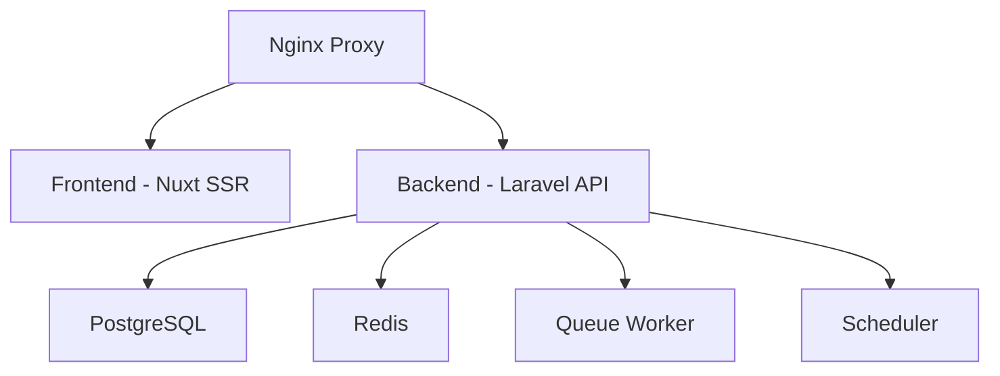

import CloudVersion from "/snippets/cloud-version.mdx";

<CloudVersion/>

<Tip>
Looking to develop OpnForm locally? Check out our [Docker Development Setup](/deployment/docker-development) guide which provides hot-reload and other development features.
</Tip>

## Quick Start

1. Clone the repository:
   ```bash
   git clone https://github.com/JhumanJ/OpnForm.git
   cd OpnForm
   ```

<Warning>
**Important for Windows Users**: Ensure script files maintain LF (Unix-style) line endings. If you're using Windows, configure Git to preserve line endings:
```bash
git config core.autocrlf false
```
And check/fix the artisan script before running setup:
```bash
# Using Git Bash or WSL
dos2unix api/artisan
```
Otherwise, Docker containers may hang at "Waiting for DB to be ready" during startup.
</Warning>

2. Run the setup script:
   ```bash
   chmod +x scripts/docker-setup.sh
   ./scripts/docker-setup.sh
   ```

   The script will:
   - Create necessary environment files
   - Pull required Docker images
   - Start all containers in production mode
   - Display access information

3. Access your OpnForm instance at `http://localhost`

### Initial Login

After deployment, use these credentials to access the app:

-   Email: `admin@opnform.com`
-   Password: `password`

You will be prompted to change your email and password after your first login.

<Note>Public registration is disabled in the self-hosted version. Use the admin account to invite additional users.</Note>

## Architecture



### Components

<Tabs>
  <Tab title="Frontend">
    The Nuxt frontend service:
    - Server-Side Rendered application
    - Built with Vue 3 and Tailwind CSS
    - Handles dynamic rendering and client-side interactivity
    - Optimized for production performance
  </Tab>
  <Tab title="Backend">
    The Laravel API service:
    - Handles business logic and data persistence
    - Provides REST API endpoints
    - Manages file uploads and processing
    - Includes required PHP extensions (pgsql, redis, etc.)
    - Configured for PostgreSQL and Redis connections
  </Tab>
  <Tab title="Workers">
    Background processing services:
    - **API Worker**: Processes queued jobs (emails, exports, etc.)
    - **API Scheduler**: Handles scheduled tasks and periodic cleanups
    - Both share the same codebase as the main API
  </Tab>
  <Tab title="Databases">
    Data storage services:
    - **PostgreSQL**: Primary database for all application data
    - **Redis**: Used for:
      - Session storage
      - Cache
      - Queue management
      - Real-time features
  </Tab>
  <Tab title="Proxy">
    The Nginx proxy service:
    - Routes requests between frontend and backend
    - Handles SSL termination
    - Manages file upload limits
    - Serves static assets
    - Configured for optimal performance
  </Tab>
</Tabs>

## Docker Images

OpnForm provides pre-built Docker images for easy deployment:

- [OpnForm API Image](https://hub.docker.com/r/jhumanj/opnform-api)
- [OpnForm Client Image](https://hub.docker.com/r/jhumanj/opnform-client)

### Building Custom Images

While we recommend using the official images, you can build custom images if needed:

```bash
# Build all images
docker compose build

# Or build specific images
docker build -t opnform-api:local -f docker/Dockerfile.api .
docker build -t opnform-ui:local -f docker/Dockerfile.client .
```

### Custom Configuration
Create a `docker-compose.override.yml` to customize your deployment:

```yaml
services:
  api:
    image: opnform-api:local
    environment:
      PHP_MEMORY_LIMIT: 1G
  ui:
    image: opnform-ui:local
  ingress:
    volumes:
      - ./custom-nginx.conf:/etc/nginx/conf.d/default.conf
```

## Environment Variables

For detailed information about environment variables and how to update them in Docker, see our [Environment Variables](/configuration/environment-variables#docker-environment-variables) documentation.

## Maintenance

### Updates

1. Pull latest changes:
   ```bash
   git pull origin main
   ```

2. Update containers:
   ```bash
   docker compose pull
   docker compose up -d
   ```

### Monitoring

View container logs:
```bash
# All containers
docker compose logs -f

# Specific container
docker compose logs -f api
```

Monitor container health:
```bash
docker compose ps
```

## Troubleshooting

### Container Issues

If containers aren't starting:
```bash
# View detailed logs
docker compose logs -f

# Recreate containers
docker compose down
docker compose up -d
```

### Database Issues

If database connections fail:
```bash
# Check database status
docker compose exec db pg_isready

# View database logs
docker compose logs db
```

If the API container is stuck on "Waiting for DB to be ready":
```bash
# Check for line ending issues in the artisan script
# The file should use LF (Unix) line endings, not CRLF (Windows)

# Fix line endings on Unix/Mac:
sed -i 's/\r$//' api/artisan

# Fix line endings on Windows (using Git Bash or WSL):
dos2unix api/artisan
```

<Note>
**Line Ending Issue**: When using Git or code editors on Windows, line endings in the `artisan` script may be converted from LF (Unix-style) to CRLF (Windows-style). This prevents the Docker container from properly executing the script, causing it to hang at "Waiting for DB to be ready". Always ensure script files maintain LF line endings.
</Note>

### Cache Issues

Clear various caches:
```bash
# Clear application cache
docker compose exec api php artisan cache:clear

# Clear config cache
docker compose exec api php artisan config:clear

# Clear route cache
docker compose exec api php artisan route:clear
```

### Permission Issues

Fix storage permissions:
```bash
docker compose exec api chown -R www-data:www-data storage
docker compose exec api chmod -R 775 storage
```
